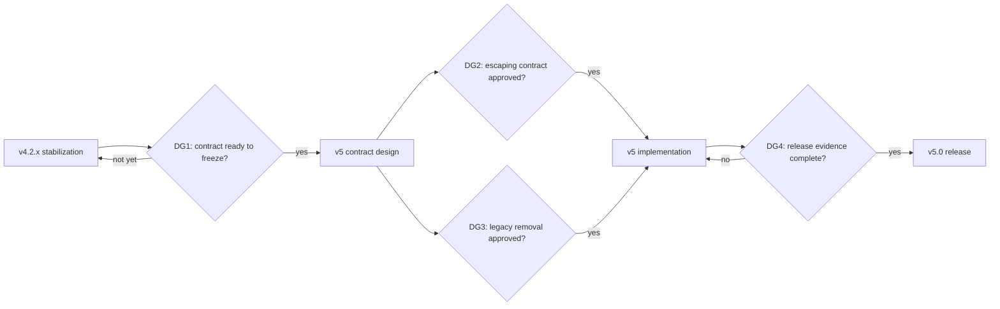

# Anatomy development roadmap

Last reviewed: 2026-09-12  
Current stable baseline: `v4.2.0`

This document records the intended direction after version 4.2. It is a
planning artifact, not a promise that every candidate feature will ship. A
decision gate must be passed before work that changes the public contract moves
from design into implementation.

## Current baseline and constraints

Version 4.2 established the contract that future releases must either preserve
or migrate explicitly:

- `render( $template, [] )` returns the original template without parsing tags,
  blocks, or syntax.
- `renderBlock()` still parses and renders a requested hard-coded block when its
  data argument is empty.
- `{{tag}}` renders raw data in version 4; `{{tag|e}}` opts into HTML escaping.
- Inserted values are opaque and are not interpreted as template source.
- Block definitions are parsed by a deterministic stack-based parser.
- Invalid data, malformed syntax, unknown blocks, and cyclic containers fail
  explicitly.
- The version 3 compatibility namespace is deprecated and remains available
  throughout the version 4 lifecycle.
- CI tests PHP 8.0 through 8.5 and blocks delivery on Composer validation,
  dependency audit, static analysis, at least 95% line coverage, and at least
  75% path coverage.

## Recommended delivery order

Recommended order: E1 first; E2 starts only after DG1; E3 requires both DG2
and DG3; E4 begins after an implementation-complete release candidate and owns
DG4.

## Decision gates

### DG1. Freeze the version 4.2 contract for version 5 design

Problem and premise: Before 4.2, several behaviors were implicit and lightly
tested. Version 4.2 made them explicit, but immediately designing a major
release around a new contract could preserve assumptions that have not yet had
real maintenance exposure. A short stabilization phase is needed to separate
actual consumer problems from speculative improvements.

Decision: either freeze the documented 4.2 behavior as the migration baseline
for version 5, or continue 4.2.x stabilization before major-version design.

Required evidence:

- no unresolved critical correctness or security defect in the current API;
- at least one completed 4.2.x maintenance review, even if no patch release was
  required;
- all CI quality gates remain green on `master`;
- known compatibility reports are classified as bugs, documentation gaps, or
  intentional contract changes;
- performance and parser-stress baselines exist for comparison with version 5.

Go outcome: the 4.2 contract is frozen as the source for migration tests and E2
may proceed.  
No-go outcome: defects remain in E1; version 5 contract work stays in design and
no breaking implementation begins.  
Owner: maintainer acting as delivery owner.

### DG2. Approve the version 5 escaping contract

Problem and premise: Raw `{{tag}}` output is retained in version 4 for backward
compatibility, but it is unsafe when callers accidentally pass untrusted HTML.
The existing `|e` modifier only covers HTML text and quoted HTML attributes; it
does not safely encode JavaScript, CSS, or URL contexts. Changing the default is
desirable but necessarily breaking and must not be hidden in a minor release.

Decision: choose the version 5 output model. The recommended direction is HTML
escaping by default with an explicit raw-output form, while leaving JavaScript,
CSS, and URL encoding outside the generic template primitive. The exact raw
syntax remains an ADR decision.

Required evidence:

- an approved ADR specifies raw, escaped, missing, `null`, scalar, `Stringable`,
  array, and container behavior;
- the raw opt-out syntax cannot be confused with predefined tags;
- migration examples cover HTML text and quoted attributes and explicitly warn
  about unsupported output contexts;
- contract tests demonstrate that inserted template-like data remains opaque;
- the compatibility impact on existing version 4 templates is documented.

Go outcome: the chosen contract becomes executable version 5 acceptance tests.  
No-go outcome: version 4 behavior remains unchanged and E3 cannot implement a
new escaping default.  
Owner: maintainer; security-sensitive changes require independent review.

### DG3. Approve removal of the legacy namespace

Problem and premise: Maintaining the version 3 renderer duplicates parsing and
replacement behavior and increases the regression surface. It has been
deprecated since 4.2, but package download counts cannot reveal whether a
consumer imports `iTRON\\Templater\\Templater`; removal without a migration path
could cause avoidable production failures.

Decision: remove the legacy namespace in version 5, or retain a separately
versioned compatibility package or bridge for one more cycle.

Required evidence:

- a mapping exists for every supported legacy construct and its version 5
  replacement;
- a migration guide includes representative before/after templates and PHP;
- the deprecation has been present for the agreed version 4 support window;
- all known legacy-only defects are either fixed for version 4 or documented;
- the release notes name the removed namespace and the supported migration path.

Go outcome: legacy code and its dedicated tests are removed in E3, while
migration fixtures remain.  
No-go outcome: removal is deferred; the core security contract may still evolve
only if the compatibility boundary is explicit.  
Owner: maintainer acting as compatibility owner.

### DG4. Release version 5.0

Problem and premise: Version 5 is expected to combine at least one security
default change with legacy removal. Unit tests alone are insufficient evidence
for a major release because failures may appear in migration, pathological
parser input, package installation, or supported PHP runtimes.

Decision: promote the release candidate to `v5.0.0`, or return it to E3 with a
named failing criterion.

Required evidence:

- the PHP support matrix and all quality gates pass from a clean lockfile;
- migration fixtures cover every approved breaking change;
- parser fuzz/property tests and performance budgets pass;
- the changelog, template-language contract, README, upgrade guide, and API
  examples agree;
- a release candidate has completed independent regression and security review;
- rollback and version 4 support expectations are documented.

Go outcome: create the SemVer tag and GitHub release through the gated release
workflow.  
No-go outcome: no release tag is created; the failing evidence becomes an E3
task with an owner and verification path.  
Owner: release owner, separate from the final independent reviewer where
practical.

## E1. Harden and observe the version 4 line

Outcome: Version 4 remains predictable for existing consumers while providing
enough evidence to design version 5 safely.

Scope:

- regression-only 4.2.x fixes that preserve the documented contract;
- publish coverage totals and reports from CI, not only pass/fail state;
- raise static-analysis precision without changing public behavior;
- bounded parser property tests and malformed-input corpora;
- repeatable performance and memory baselines for parser, tags, and containers.

Out of Scope:

- changing raw output to escaped output;
- removing the legacy namespace;
- adding a second template language or plugin system.

Success Criteria:

- all supported PHP versions remain green;
- line coverage stays at or above 95% and path coverage at or above 75%;
- coverage evidence is visible from each CI run;
- no known critical defect is left unclassified;
- parser stress and rendering benchmark baselines are reproducible.

Dependencies:

- released `v4.2.0` baseline;
- GitHub Actions and Packagist remain available.

Risks/Open Questions:

- Xdebug path coverage includes infeasible control-flow combinations;
- static-analysis tightening may expose type-model limitations rather than
  runtime defects;
- performance budgets need representative template sizes.

Tasking Guidance:

- Re-run `$decompose-work` on this epic with the current contracts, CI results,
  and defects.
- Produce execution tasks using Status, Goal, Scope, Out of Scope, DoR, DoD,
  AC, Dependencies, and Notes/Risks.
- Do not mark breaking behavior changes as `todo` in this epic.

## E2. Design the version 5 contract and migration

Outcome: Every intended breaking change is explicit, reviewed, and represented
by executable examples before implementation starts.

Scope:

- ADR for default escaping and explicit raw output;
- review of value normalization, exceptions, block grammar, and empty-data
  behavior;
- decision on legacy removal and any compatibility bridge;
- migration guide and contract-test plan.

Out of Scope:

- implementing the new renderer behavior;
- unrelated template features such as inheritance, macros, or arbitrary PHP
  execution.

Success Criteria:

- DG1, DG2, and DG3 have recorded decisions and evidence;
- each breaking change has before/after examples and acceptance tests;
- the security boundary for HTML, JavaScript, CSS, and URLs is unambiguous;
- migration work can be decomposed without another contract discussion.

Dependencies:

- E1 evidence and DG1 approval;
- maintainer and independent security review availability.

Risks/Open Questions:

- the raw-output syntax is not yet selected;
- consumers may rely on behavior not visible from package telemetry;
- changing empty-data behavior is not currently recommended and would require a
  separate explicit gate.

Tasking Guidance:

- Re-run `$decompose-work` after each ADR is accepted.
- Produce separate design, migration-fixture, documentation, and verification
  tasks; do not combine them into one implementation ticket.
- Use `needs_design` until the relevant decision gate is passed.

## E3. Implement and verify version 5

Outcome: The approved version 5 contract is implemented without reintroducing
parser ambiguity, recursive data evaluation, or silent failure modes.

Scope:

- implement the approved escaping and raw-output semantics;
- remove or isolate the legacy namespace according to DG3;
- update contract, migration, fuzz, stress, and performance tests;
- update all public documentation and examples;
- produce a release candidate through the normal CI pipeline.

Out of Scope:

- contract choices not approved in E2;
- unrelated syntax features;
- lowering version 4 quality gates to make the release pass.

Success Criteria:

- all E2 acceptance tests pass across the supported PHP matrix;
- inserted data remains opaque and cycle handling remains deterministic;
- parser and render benchmarks stay within budgets agreed in E1;
- the release candidate passes independent functional and security QA.

Dependencies:

- DG2 and DG3 approval;
- accepted ADRs and migration fixtures from E2;
- benchmark and fuzz infrastructure from E1.

Risks/Open Questions:

- escaping changes can produce visible output differences in every consumer;
- removing legacy autoload entries can break installation-time assumptions;
- PHP support may need a separate decision if version 5 development extends
  beyond the currently tested runtime window.

Tasking Guidance:

- Re-run `$decompose-work` using accepted ADRs as immutable inputs.
- Split implementation by contract slice and give each task its own migration
  fixture, tests, and rollback note.
- Tasks depending on an unpassed gate must remain `waiting_dependency`.

## E4. Release and support version 5

Outcome: Version 5 ships through a reproducible gate with clear upgrade and
version 4 support expectations.

Scope:

- release-candidate feedback and defect triage;
- final documentation consistency review;
- DG4 evidence pack, tag, and GitHub release;
- published version 4 maintenance/support policy.

Out of Scope:

- new version 5.1 features;
- bypassing a failed quality or migration gate;
- silent post-release contract changes.

Success Criteria:

- DG4 passes with independently reviewed evidence;
- Packagist resolves the released version and declared PHP requirement;
- the GitHub release, changelog, and migration guide are linked from README;
- support expectations for the version 4 line are explicit.

Dependencies:

- implementation-complete E3 release candidate;
- release workflow with write permission only in the gated release job.

Risks/Open Questions:

- ecosystem feedback may require another release candidate;
- Packagist and badge caches can lag behind the GitHub release;
- a major upgrade may need an overlap period with version 4 security fixes.

Tasking Guidance:

- Re-run `$decompose-work` against the release-candidate evidence and DG4.
- Split go/no-go review, release execution, publication verification, and
  post-release monitoring into separate tasks.
- Do not create a final tag until all release tasks meet DoD.

## Near-term execution backlog

### T1. Publish coverage evidence in CI

Status: `todo`  
Goal: Make the exact line and path totals inspectable from every quality run.  
Scope: Write totals to the GitHub job summary and retain a coverage artifact.  
Out of Scope: Changing thresholds or adding a third-party coverage service.  
DoR: Current coverage command and thresholds are green.  
DoD: Successful and failed quality runs expose totals; the artifact has a
documented retention period.  
AC: Given a CI run, when quality completes, then a reviewer can read exact line
and path totals without privileged log access.  
Dependencies: Existing `dev/check-coverage.php` output.  
Notes/Risks: Do not expose repository secrets or machine-specific paths.

### T2. Raise static analysis to the strictest practical level

Status: `todo`  
Goal: Remove the known type-shape uncertainty currently hidden above PHPStan
level 5.  
Scope: Resolve parser result shapes, container element shapes, and Core callback
types; raise the committed PHPStan level after a clean run.  
Out of Scope: Runtime contract changes or broad style rewrites.  
DoR: Current level 5 analysis and tests pass.  
DoD: The selected stricter level is committed, green in CI, and has no blanket
ignore for first-party source.  
AC: Given the repository, when `composer analyse` runs, then all first-party
source passes at the new configured level.  
Dependencies: None beyond E1 baseline.  
Notes/Risks: Some findings describe PHPDoc precision, not runtime bugs; keep
commits behavior-preserving.

### T3. Design parser property and fuzz testing

Status: `needs_design`  
Goal: Define a bounded test strategy for malformed markers, nesting, duplicate
definitions, and large inputs.  
Scope: Select generators/corpus, deterministic seeds, time and memory budgets,
and the CI schedule.  
Out of Scope: Changing the block grammar.  
DoR: The template-language grammar is the source of truth.  
DoD: A reviewed test-strategy document makes implementation independently
taskable.  
AC: Given the strategy, when a worker implements it, then expected invariants,
resource limits, and failure reproduction are unambiguous.  
Dependencies: DG1 evidence collection.  
Notes/Risks: Unbounded fuzzing would make CI slow or nondeterministic.

### T4. Establish rendering performance budgets

Status: `needs_design`  
Goal: Detect meaningful parser, tag, and nested-container regressions before
version 5.  
Scope: Representative fixtures, repeatable runner, warm-up policy, memory
measurement, and regression tolerances.  
Out of Scope: Premature runtime optimization.  
DoR: Representative workloads and runner constraints are selected.  
DoD: Baselines are reproducible locally and in their designated CI job.  
AC: Given the same fixture class, when a candidate exceeds an agreed budget,
then CI reports the failing workload and observed delta.  
Dependencies: Test-strategy and environment decision.  
Notes/Risks: Shared CI timing is noisy; budgets must include justified
tolerance.

### T5. Write the version 5 escaping ADR

Status: `needs_design`  
Goal: Turn DG2 into a precise, reviewable output contract.  
Scope: Default HTML escaping, raw opt-out candidates, supported contexts, value
types, migration examples, and acceptance cases.  
Out of Scope: Implementation before approval or automatic JavaScript/CSS/URL
encoding.  
DoR: DG1 has frozen the migration baseline and a security reviewer is assigned.  
DoD: The ADR is accepted and all decisions map to version 5 contract tests.  
AC: Given any currently supported value type, when its raw and escaped version
5 behavior is queried, then the ADR gives one deterministic answer.  
Dependencies: DG1.  
Notes/Risks: The syntax must not collide with predefined-tag grammar.

### T6. Build the legacy migration inventory

Status: `todo`  
Goal: Give DG3 evidence for removing or isolating the version 3 namespace.  
Scope: Map legacy syntax and PHP entry points to current equivalents; identify
gaps and produce before/after fixtures.  
Out of Scope: Removing legacy code.  
DoR: Version 4.2 legacy tests and deprecation policy are available.  
DoD: Every supported legacy construct has a tested migration or an explicit
unsupported decision.  
AC: Given each legacy fixture, when its documented migration is applied, then
the current API produces the intended equivalent output.  
Dependencies: None.  
Notes/Risks: Package telemetry cannot identify namespace-level usage.

### T7. Implement the approved version 5 contract

Status: `waiting_dependency`  
Goal: Deliver the breaking changes accepted by DG2 and DG3.  
Scope: Production code, contract tests, migration fixtures, and documentation
for only the approved decisions.  
Out of Scope: Unapproved syntax and opportunistic features.  
DoR: DG2 and DG3 are passed; E2 artifacts are complete.  
DoD: E3 success criteria and the supported PHP matrix pass.  
AC: Given the accepted version 5 fixtures, when the new renderer runs, then all
new and migration outputs match their documented contracts.  
Dependencies: T3-T6 as selected by E2, DG2, and DG3.  
Notes/Risks: Keep migration changes reviewable in small contract slices.

### T8. Release version 5.0.0

Status: `waiting_dependency`  
Goal: Publish the verified major release and its upgrade path.  
Scope: DG4 review, SemVer tag, GitHub release, Packagist verification, and
post-release monitoring.  
Out of Scope: Fixing failed gates after a tag is created.  
DoR: E3 release candidate is complete and DG4 passes.  
DoD: `v5.0.0` resolves from Packagist, release artifacts are linked, and all
remote refs target the approved SHA.  
AC: Given a clean supported PHP project, when it requires the documented
version 5 constraint, then Composer installs the approved release and the
upgrade examples pass.  
Dependencies: E3 and DG4.  
Notes/Risks: A no-go result creates owned remediation tasks; it never lowers the
release gates.
